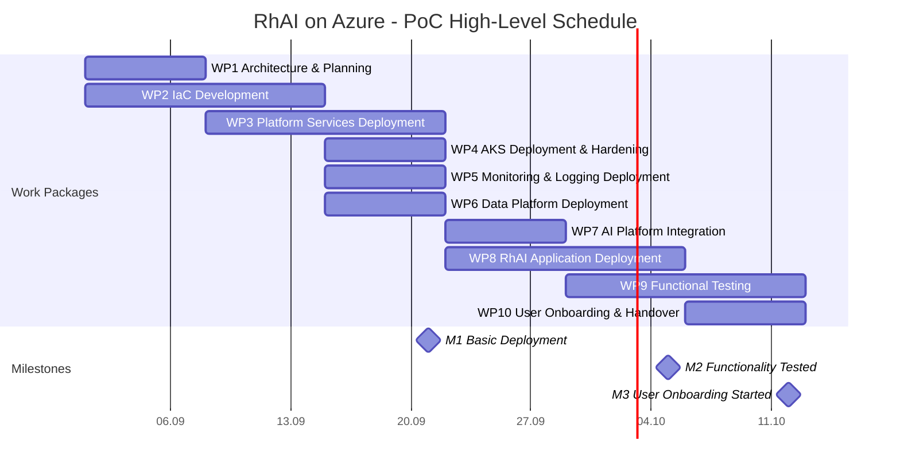

# RhAI on Azure – Proof of Concept (PoC) Project Plan

## 1. Project Objective

The objective of this Proof of Concept (PoC) is to establish a fully operational RhAI platform on Microsoft Azure, deployed on Azure Kubernetes Service (AKS) and managed through Infrastructure as Code (Terraform or Bicep).

The solution shall provide a production-like development and testing environment that contains all platform components required to operate the RhAI ecosystem, including GitOps, container registry, observability, AI integration, data services, and business applications. The target architecture is based on the existing RhAI deployment topology and application landscape documented in the provided setup guide. [\

A key objective is the integration of Azure AI Foundry hosted foundation models through LiteLLM, providing a centralized and standardized LLM access layer for RhAI applications. The existing architecture already positions LiteLLM as the central AI gateway consumed by multiple applications. 

***

# 2. Scope

The PoC includes the deployment and configuration of the following components:

### Platform Services

* Azure Kubernetes Service (AKS)
* Harbor Container Registry  (PaaS)
* ArgoCD (vermutlich PaaS)
* Git Hub Enterprise (zu klären mit RITS IT)
* Azure Key Vault
* Kubernetes ingress and networking
* Persistent storage

### Data Services

* PostgreSQL
* Redis

### Observability Services

* Prometheus
* Grafana
* Azure Log Analytics & Monitoring 

### AI Services

* LiteLLM
* Azure AI Foundry hosted LLMs

### RhAI Applications

* RhAI-HIR
* RhAI-SE-Backend
* RhAI-SE-Frontend
* Smart Document Review
* OpenWebUI
* Docling

These applications and supporting services are identified as part of the existing RhAI environment.

***

# 3. Security, Compliance and Governance Requirements

The Azure platform will be implemented according to the client's requirement according CIS Benchmark Level 1 und BIS recommendations.

### Security Principles

* Infrastructure and platform design aligned to client CIS Benchmark Level 1.
* Client-specific RBAC and identity model
* Secure secret management using Azure Key Vault
* Network segmentation and access control according to client requirements
* Infrastructure deployed exclusively through Infrastructure as Code
* Security-by-policies platform configuration
* Auditability and configuration traceability

### AKS Hardening

The AKS environment will be hardened according to recognized industry best practices with the objective of achieving:

* CIS Kubernetes Benchmark Level 1 compliance
* Secure Kubernetes RBAC configuration
* Secure workload identity implementation
* Network policies and namespace isolation
* Security baseline validation during testing

The final implementation will be tailored to the client's security and compliance policies while maintaining operational usability.

***

# 4. Target Architecture

## Infrastructure Layer

* Azure Resource Group(s)
* Virtual Network
* Private networking (where required)
* Azure Managed Disks
* Azure Load Balancer / Application Gateway
* Azure Key Vault

## Platform Layer

* AKS Cluster
* Harbor Registry
* ArgoCD
* Github Enterprise

## Observability Layer

* Prometheus
* Grafana
* Azure Log Analytics & Monitoring 

## Data Layer

* PostgreSQL
* Redis
* Persistent Volumes

## AI Layer

* LiteLLM
* Azure AI Foundry hosted models

## Application Layer

* OpenWebUI
* Docling
* Smart Document Review
* RhAI-HIR
* RhAI-SE Backend
* RhAI-SE Frontend

***

# 5. Work Packages

***

## WP1 – Project Initiation and Solution Architecture

### Objectives

* Define target architecture
* Validate requirements
* Align with client standards
* Establish deployment strategy

### Activities

* Architecture workshops
* Review of RhAI application landscape
* Security and compliance assessment
* Azure landing zone design
* Network architecture design
* Namespace and tenancy design
* AI integration design
* Governance and operational model definition

### Deliverables

* Solution Architecture Document
* Security and Compliance Concept
* Operational Concept
* PoC Execution Plan

***

## WP2 – Infrastructure as Code Development

### Objectives

Develop reusable and repeatable Azure deployment artefacts.

### Activities

* Creation of Terraform or Bicep templates
* Resource Group provisioning
* Network deployment automation
* AKS deployment automation
* Key Vault deployment automation
* Managed Identity implementation
* Storage deployment automation

### Deliverables

* Terraform or Bicep Repository
* Deployment Pipeline Definitions
* Infrastructure Documentation

***

## WP3 – DevOps Platform Services

### Objectives

Deploy supporting DevOps and GitOps services.

### Activities

* Harbor deployment
* Harbor project configuration
* ArgoCD deployment
* GitOps repository onboarding
* Github Enterprise  provisioning
* Image pull secret configuration
* Namespace integration

### Deliverables

* Operational Harbor Registry
* Operational ArgoCD Platform
* Operational Forgejo Service
* GitOps Configuration

***

## WP4 – AKS Platform Deployment

### Objectives

Deploy and harden the Kubernetes platform.

### Activities

* AKS related IaC (Terraform or biceps):
  * AKS deployment
  * Node pool configuration
  * Storage class configuration
  * Ingress configuration
  * RBAC implementation
  * Azure Workload Identity configuration
  * Key Vault integration
  * Namespace setup
  * CIS Benchmark hardening
  * Security baseline validation

### Deliverables

* Operational AKS Cluster
* Security Baseline Documentation

***

## WP5 – Monitoring and Logging Platform

### Objectives

Establish platform observability.

### Activities

* Prometheus deployment
* Grafana deployment
* Azure Log Analytics & Monitoring 
* Metrics collection configuration
* Log collection configuration
* Dashboard implementation
* Alerting configuration

### Deliverables

* Monitoring Platform
* Logging Platform
* Operational Dashboards

***

## WP6 – Data Platform Deployment

### Objectives

Provide application persistence services.

### Activities

* PostgreSQL deployment
* PostgreSQL configuration
* Redis deployment
* Persistent storage configuration
* Backup and recovery concept

### Deliverables

* Operational PostgreSQL Services
* Operational Redis Services
* Storage Documentation

***

## WP7 – AI Integration Platform

### Objectives

Establish AI model connectivity.

### Activities

* LiteLLM deployment
* Azure AI Foundry model integration
* Authentication configuration
* Model routing configuration
* Endpoint validation
* AI integration testing

### Deliverables

* Operational LiteLLM Service
* Azure AI Foundry Integration
* AI Connectivity Documentation

***

## WP8 – RhAI Application Deployment

### Objectives

Deploy the complete RhAI application stack.

### Activities

* Deployment of RhAI-HIR
* Deployment of RhAI-SE Backend
* Deployment of RhAI-SE Frontend
* Deployment of Smart Document Review
* Deployment of OpenWebUI
* Deployment of Docling
* Application configuration
* Service integration
* Connectivity validation

### Deliverables

* Operational RhAI Environment
* Application Configuration Documentation

***

## WP9 – Functional and Integration Testing

### Objectives

Validate end-to-end functionality.

### Activities

* Infrastructure testing
* Platform testing
* Application testing
* Harbor validation
* GitOps validation
* AI integration testing
* Security validation
* Performance verification

### Deliverables

* Functional Test Report
* Integration Test Report
* Issue and Resolution Log

***

## WP10 – User Onboarding and Handover

### Objectives

Prepare client teams for adoption and operations.

### Activities

* Administrator training (if applicable)
* User onboarding workshops
* Operations walkthrough
* Architecture walkthrough
* Handover sessions

### Deliverables

* Administrator Guide
* User Onboarding Material
* Handover Documentation

***

# 6. Milestone Plan

## Milestone 1 – Basic Deployment

### Objective

Core Azure infrastructure and platform services are deployed and operational.

### Acceptance Criteria

* AKS deployed and operational
* Terraform/Bicep baseline completed
* Harbor operational
* ArgoCD operational
* Github Enterprise operational
* PostgreSQL operational
* Redis operational
* Monitoring stack deployed
* Logging stack deployed
* LiteLLM deployed
* Initial CIS hardening completed
* Platform baseline aligned with agreed client policies

### Deliverables

* Running AKS Platform
* IaC Repository
* Platform Services Deployment Report

***

## Milestone 2 – Functionality Tested

### Objective

All solution components are integrated and successfully validated.

### Acceptance Criteria

* RhAI applications deployed
* AI Foundry integration validated
* End-to-end workflows tested
* GitOps operational
* Harbor image lifecycle validated
* Security baseline verified
* Functional testing completed

### Deliverables

* Operational RhAI Environment
* Test Documentation
* Validation Report

***

## Milestone 3 – User Onboarding Started

### Objective

Transition from implementation to operational adoption.

### Acceptance Criteria

* Training material available
* Administrator onboarding completed
* User onboarding initiated
* Operational documentation available
* Handover sessions conducted

### Deliverables

* Operations Handbook
* Training Material
* Handover Package

***

# 7. High-Level Schedule

| Phase                                     | Duration      |
| ----------------------------------------- | ------------- |
| WP1 – Architecture & Planning             | Week 1        |
| WP2 – IaC Development                     | Week 1–2      |
| WP3 – Platform Services Deployment        | Week 2–3      |
| WP4 – AKS Deployment & Hardening          | Week 2        |
| WP5 – Monitoring & Logging Deployment     | Week 3        |
| WP6 – Data Platform Deployment            | Week 3        |
| **Milestone 1 – Basic Deployment**        | End of Week 3 |
| WP7 – AI Platform Integration             | Week 4        |
| WP8 – RhAI Application Deployment         | Week 4–5      |
| WP9 – Functional Testing                  | Week 5        |
| **Milestone 2 – Functionality Tested**    | End of Week 5 |
| WP10 – User Onboarding & Handover         | Week 6        |
| **Milestone 3 – User Onboarding Started** | End of Week 6 |

***

# Project Deliverables Summary

1. Fully operational RhAI environment on Azure
2. Azure Kubernetes Service (AKS) platform
3. Infrastructure as Code (Terraform or Bicep)
4. Harbor container registry
5. ArgoCD GitOps platform
6. Forgejo source code platform
7. PostgreSQL and Redis services
8. Prometheus, Grafana, Loki and Alloy observability platform
9. LiteLLM integration with Azure AI Foundry hosted models
10. Security-hardened AKS platform aligned to CIS Benchmark Level 1
11. Client-tailored security and governance implementation
12. Functional and integration test documentation
13. Operations and administration documentation
14. User onboarding package
15. Knowledge transfer and client handover
16. Running RhAI system ready for further development and evaluation.
